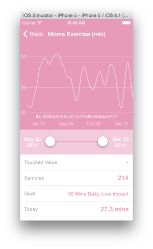

# M2X Healthy Baby app
Healthy Baby is an iOS application that demonstrates how a consumer facing health and wellness application can utilize the [AT&T M2X](https://m2x.att.com) service using the [M2X iOS Client](https://github.com/attm2x/m2x-ios).

## Installation

* install Xcode 6.3
* clone the repository
* `git submodule update --init --recursive`
* open M2XDemo.xcodeproj on Xcode and hit run

## Screenshots

## API Keys

Note that the the app uses some services like parse.com and crashlytics. If you want to use the services, make sure you have a keys/keys.json and then run ./insert-keys.js. Inside that script you can see the list of used tokens for the keys.

## Notes

* Weight, Glucose and Exercise sections create past data on the fly on M2X (considering now as 7 months from pregnancy)
* Activity section shows data that is created from the app with the 'Kicks' tracker
* To receive push notifications, make sure you configured the parse.com api keys and you're trying on a real device (won't work on simulator)
* Since M2X API is asynchronous, there could be some delay of the created data to appear on the charts

## Contributing

For initial conversation about articles start a GH issue and ping the folks you would
like to discuss with. You can think of articles as following a similar workflow to features
in a web application project.

All major features and issues should be initially reported in the
[issues section](https://github.com/citrusbyte/handbook/issues). We are
following the convention of naming an issue by prefixing its description with the
issue type, as in "Feature: xxx", "Bug: xxx", "UI: xxx", "Refactor: xxx", or **"Article: xxx"**.
Please log the issue without any milestone, so that it can then be assigned to
the corresponding one (if any).

Try to use distinct and descriptive subject lines to make issues easier to
identify. The description should include as much information as necessary to
define the issue so that implementation can begin.

Resolution will be done in its own branch, which have the following convention:
`type/NNN-feature-name` where:

* `type` is either `feature`, `bug`, `ui`, `internal`, or `article`.
* `NNN` is the issue number in GitHub.
* `feature-name` is a descriptive name for the feature you're working in.

Before you start working on an issue, you should assign it to yourself first,
and then convert it to a pull request by using
[`hub`](https://github.com/defunkt/hub) as follows:

* Create a new branch: `git checkout -b feature/123-feature-name`.
* Push your branch to GitHub repository and track it:
  `git push -u origin feature/123-feature-name`.
* Attach your remote branch to the issue and convert it to a pull request:
  `hub pull-request -i 123`.

Everything needs to be a pull request to be merged into master. Usually,
someone else (not the author) has to merge the pull request.

Usually, if the pull request doesn't involve important changes you can create a
pull request without having created an issue. If so, you should create the
branch using the `type/feature-name` convention.

Make sure to delete the branch after merging it into `master`.

### Attributions

Written by [Luis Floreani](https://github.com/lucholaf), sponsored by [Citrusbyte](https://citrusbyte.com/)

## License

This app is available under the MIT license. See the [LICENSE](LICENSE) file for more information.
